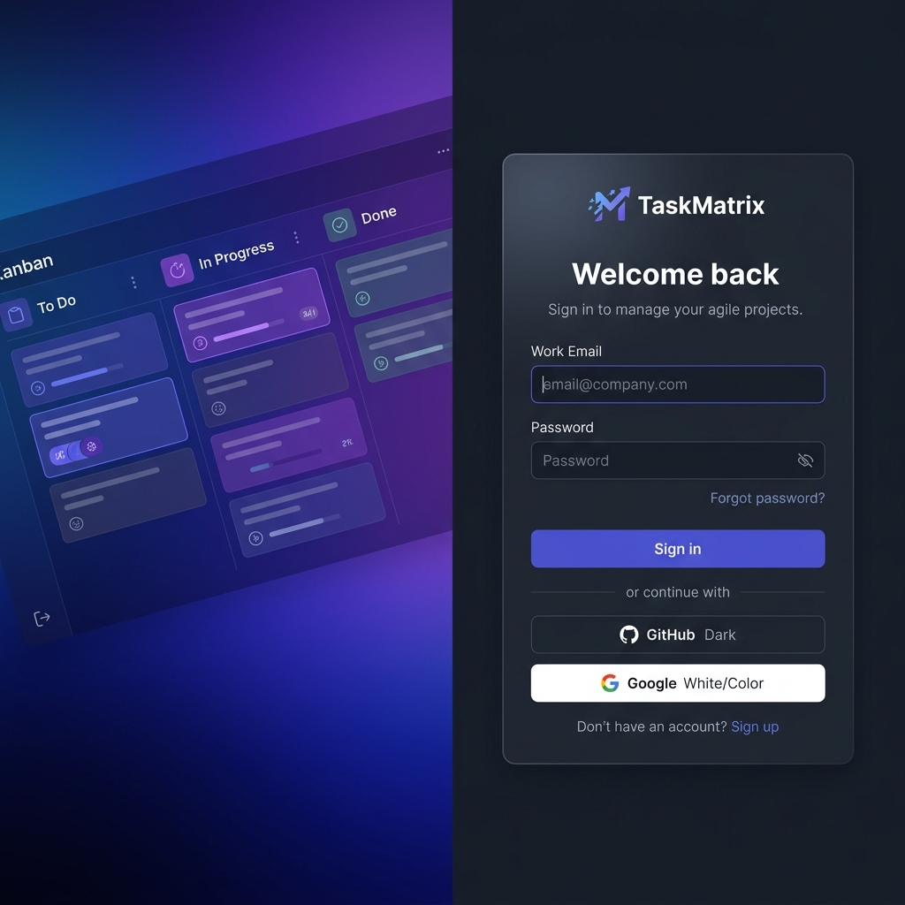
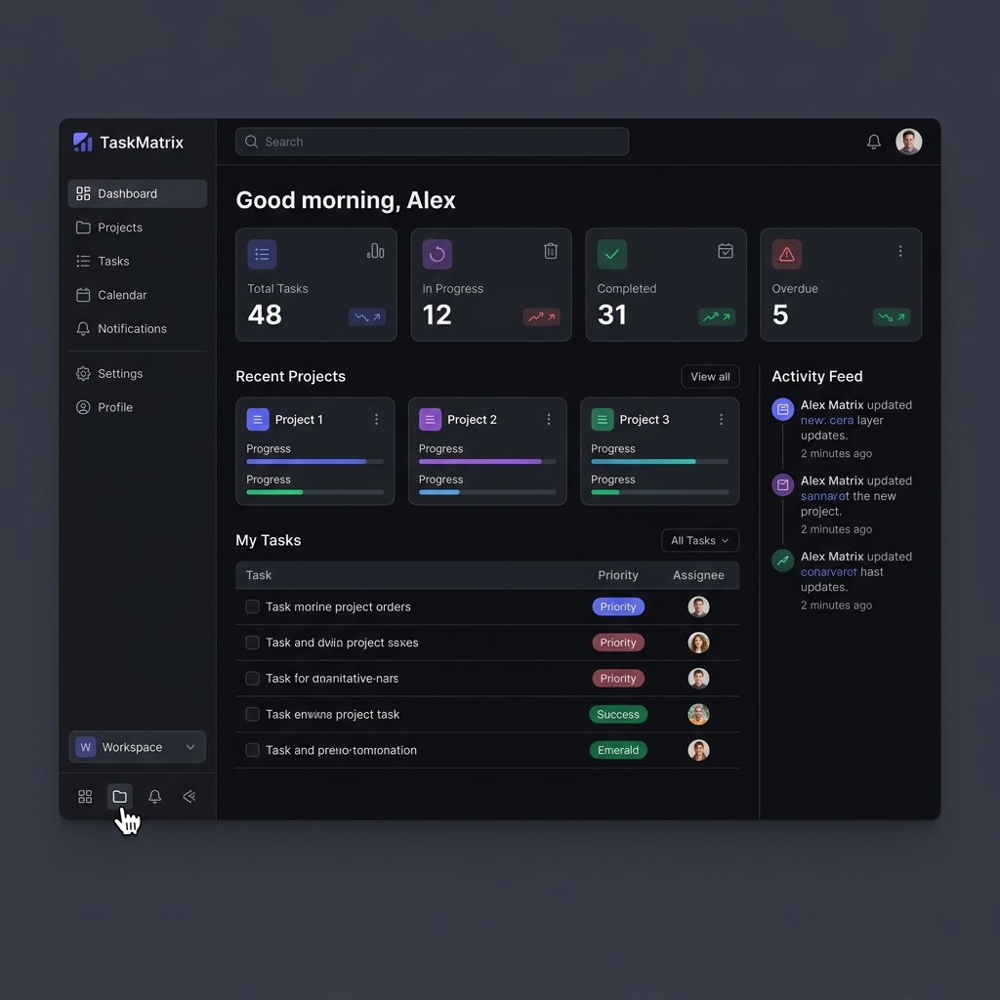
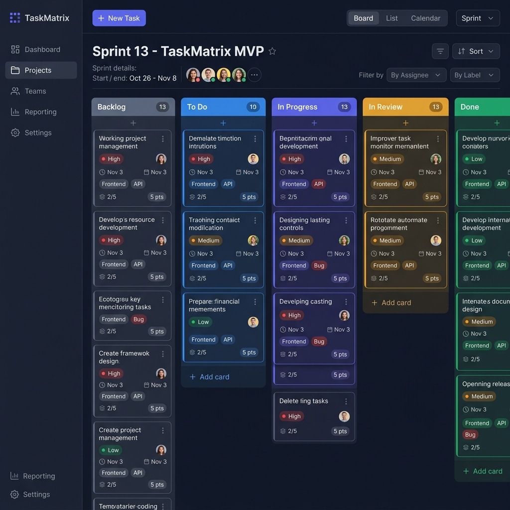
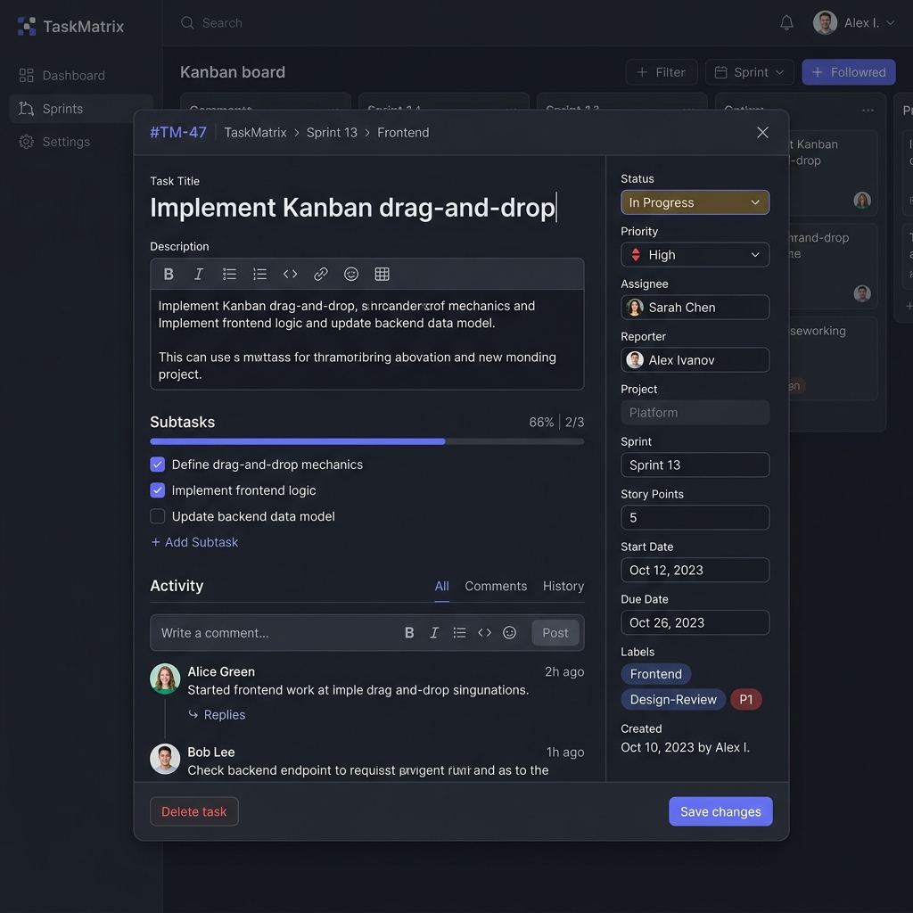
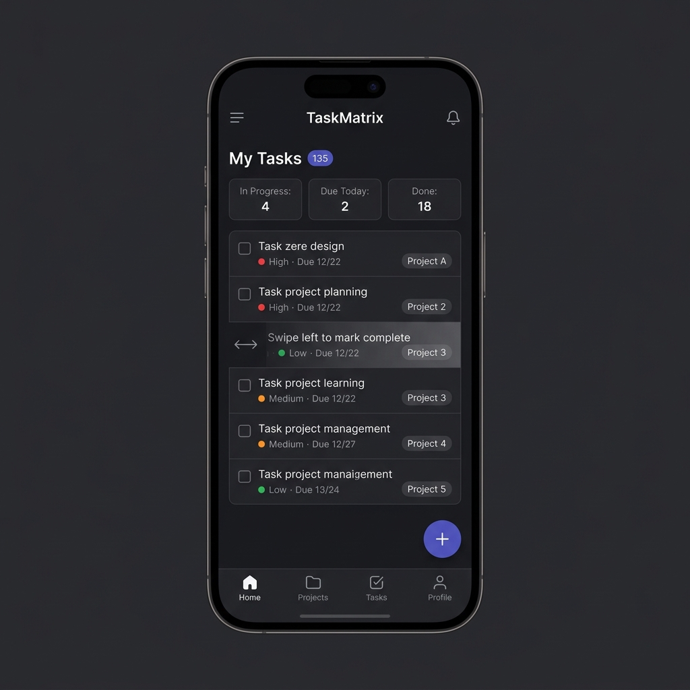
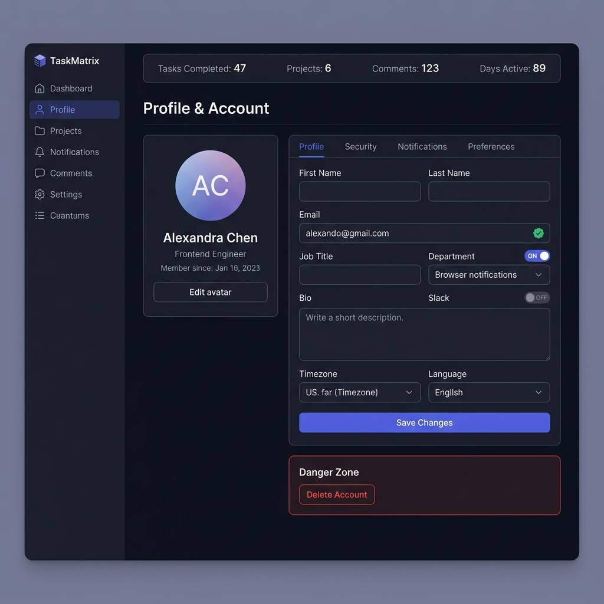
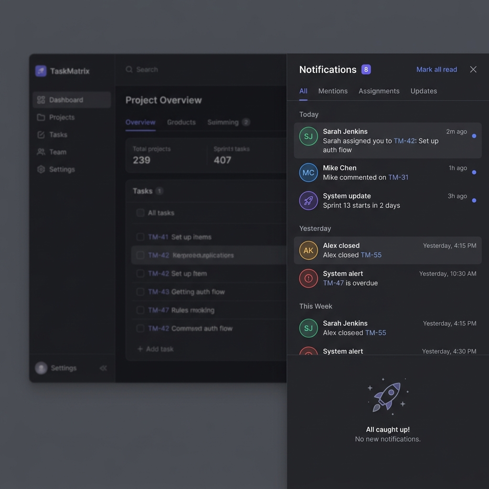
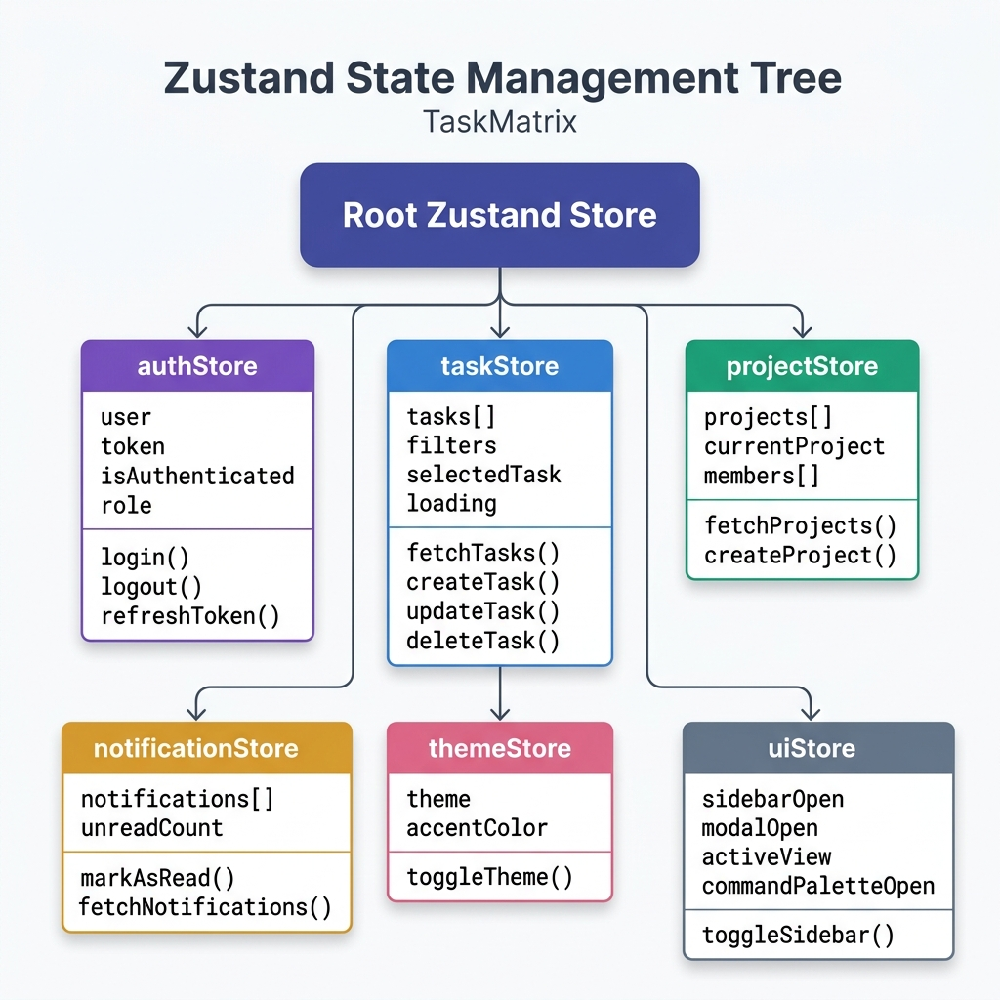
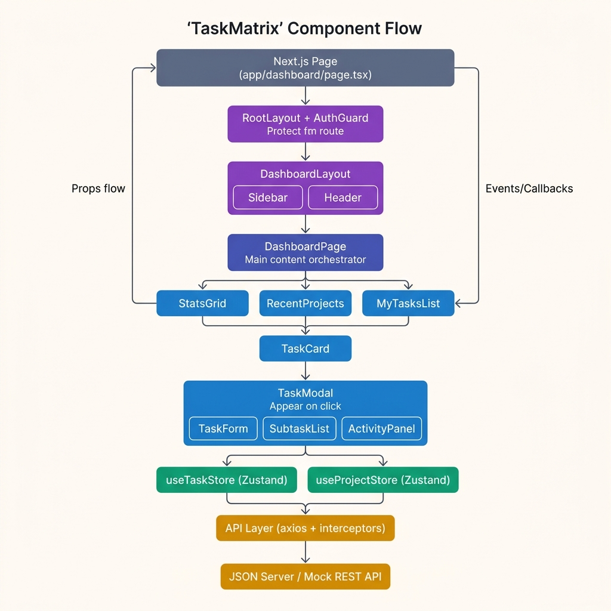

<div align="center">
  
  <h1>TaskMatrix</h1>
  <p><strong>Modern Agile Project Management — Built for engineering teams that move fast.</strong></p>

  <p>
    
    
    
    
    
    
    
  </p>

  <p>
    <a href="#project-overview">Overview</a> ·
    <a href="#tech-stack">Tech Stack</a> ·
    <a href="#core-features">Features</a> ·
    <a href="#folder-architecture">Architecture</a> ·
    <a href="#development-roadmap">Roadmap</a>
  </p>
</div>

---

## Project Overview

Engineering teams consistently lose hours every week navigating bloated project management tools that were designed for a different era of software delivery. Jira, while powerful, carries years of legacy UI decisions that slow teams down. Newer tools like Asana trade depth for simplicity, leaving engineers without the granular workflow control they need. The gap between "powerful" and "fast" has never been more apparent.

**TaskMatrix** is a modern, frontend-first Agile project management platform that closes that gap. It delivers the structured workflow management that engineering teams depend on — sprints, kanban boards, task hierarchies, and real-time status tracking — wrapped in an interface that respects the user's time and cognitive load.

The application is purpose-built for small-to-medium engineering teams operating in a sprint cadence. Whether a team runs two-week sprints with daily standups or uses a continuous-flow kanban model, TaskMatrix adapts to the workflow rather than forcing the team to adapt to the tool.

### Who This Is For

| User Type | Primary Need | How TaskMatrix Serves Them |
|-----------|-------------|---------------------------|
| **Engineering Leads** | Sprint planning, velocity tracking, blocker identification | Project dashboards, sprint management, overdue task flags |
| **Frontend/Backend Engineers** | Personal task queue, status updates, pull-request linking | My Tasks view, task detail modal, GitHub integration (Phase 3) |
| **Product Managers** | Cross-team visibility, milestone tracking, release planning | Analytics dashboard, calendar view, activity feeds |
| **QA Engineers** | Test case tracking, bug triage, regression visibility | Filtering, label system, priority queues |

---

## Project Vision

### Mission

To reduce the friction between planning and execution for software engineering teams by providing a focused, opinionated workflow tool that prioritizes clarity, speed, and keyboard-first interaction.

### Goals

- **For the intern sprint (Sprint 13–17):** Deliver a complete, deployable frontend application that demonstrates production-level code organization, design system discipline, and UI/UX thinking.
- **For the platform long-term:** Build a tool that engineering teams would genuinely prefer to use over existing solutions, not just because it looks better, but because it removes the clicks and context switches that break flow states.

### Business Value

A well-designed internal tooling product signals engineering maturity. TaskMatrix serves as a reference implementation for our frontend standards — demonstrating how we approach component architecture, state management, API contract design, and progressive feature delivery. The patterns established here can be extracted into our internal component library.

### User Value

Every UI decision in TaskMatrix is made with one question: *does this reduce the time between "I have a task to do" and "the task is done and documented"?* Features that don't serve that question don't ship.

### Future Scalability

The architecture is deliberately designed to support a backend migration without UI changes. The API layer is abstracted behind a service module — swapping `json-server` for a real Express/Fastify backend requires changes only inside `src/lib/api/`, not in any component. Real-time updates via WebSocket can be layered on top of existing store subscriptions.

---

## Tech Stack

| Category | Technology | Version | Purpose |
|----------|-----------|---------|---------|
| **Framework** | Next.js | 15.x | App Router, SSR/SSG capabilities, file-based routing |
| **UI Library** | React | 19.x | Component model, concurrent rendering, Suspense |
| **Styling** | Tailwind CSS | 4.0 | Utility-first styling with design token system |
| **Component Library** | shadcn/ui | latest | Accessible, composable primitive components |
| **State Management** | Zustand | 5.x | Lightweight global state with subscriptions |
| **Form Management** | React Hook Form | 7.x | Performant, uncontrolled form handling |
| **Validation** | Zod | 3.x | Schema-first runtime validation, TypeScript inference |
| **HTTP Client** | Axios | 1.x | Request/response interceptors, auth token injection |
| **Animation** | Framer Motion | 11.x | Spring physics, layout animations, gesture handling |
| **Persistence** | LocalStorage | — | Auth token persistence, theme preference, draft tasks |
| **Mock API** | JSON Server | 1.x | RESTful mock backend from `db.json` |
| **Deployment** | Vercel | — | Zero-config Next.js deployment, preview environments |
| **Linting** | ESLint | 9.x | Code quality enforcement with custom rule set |
| **Formatting** | Prettier | 3.x | Consistent code formatting across the team |
| **Git Hooks** | Husky + lint-staged | latest | Pre-commit quality gates |
| **CI/CD** | GitHub Actions | — | Automated lint and build checks on pull requests (Phase 2+) |

### Why This Stack

Next.js 15 with the App Router gives us the structural flexibility to co-locate server and client components, which matters when we introduce real API calls later. Zustand over Redux is a deliberate choice — the store is trivially readable, the boilerplate is minimal, and the performance characteristics are better than Context for this use case. shadcn/ui provides accessible primitives that we own and can customize freely, rather than fighting against a third-party component library's opinions.

---

## Core Features

### Phase 1 — MVP (Sprint 14–15)

These features constitute the minimum viable experience. A user should be able to sign in, see their work, manage tasks on a board, and track progress — nothing else.

| Feature | Description | Priority |
|---------|-------------|----------|
| **Authentication UI** | Login and signup forms with validation, protected route guard, persistent session via LocalStorage | P0 |
| **Dashboard** | Personal overview — KPI stats, recent projects, my task queue, quick-add task | P0 |
| **Kanban Board** | Drag-and-drop columns (Backlog → To Do → In Progress → In Review → Done), add/edit/delete cards | P0 |
| **Task Cards** | Title, priority badge, assignee avatar, due date, label chips, subtask progress indicator | P0 |
| **Task Details Modal** | Full task editor — description, subtasks, comments, metadata panel, inline title editing | P0 |
| **Responsive Layout** | Desktop sidebar, tablet collapsible sidebar, mobile bottom-nav with sheet drawer | P0 |
| **Dark Mode** | System-aware default, manual toggle, preference persisted in `themeStore` | P1 |
| **Profile Page** | Avatar, bio, editable name/email/title, notification preferences, account settings | P1 |
| **Notifications UI** | Slide-in panel, unread count badge, grouped by date, mark all read, filter tabs | P1 |
| **Search** | Command palette (⌘K) with task, project, and navigation fuzzy search | P1 |
| **Filtering** | Filter tasks by assignee, priority, label, status, date range | P1 |

### Phase 2 — Extended Features (Sprint 16)

| Feature | Description |
|---------|-------------|
| **Calendar View** | Month/week/day views with drag-to-reschedule task due dates |
| **Comments** | Threaded commenting on task detail, @mention parsing, real-time optimistic updates |
| **Activity Feed** | Per-task and per-project audit trail — status changes, assignments, comments |
| **Analytics Dashboard** | Velocity charts, burndown, task completion rates, workload distribution |
| **Workspace Settings** | Team member management, project templates, label management, sprint configuration |

### Phase 3 — Advanced (Sprint 17+)

| Feature | Description |
|---------|-------------|
| **AI Task Suggestions** | Auto-generate subtask breakdowns from a task title using LLM API |
| **Voice Notes** | Web Audio API voice recording attached to task comments |
| **Slack Integration** | Post task updates to Slack channels via webhook |
| **GitHub Integration** | Link pull requests to tasks, auto-update status on PR merge |
| **File Upload** | Attach screenshots, documents to task descriptions |
| **Offline Support** | Service worker + IndexedDB for offline task creation with background sync |

---

## Folder Architecture

```
prodesk-capstone-taskmatrix/
├── src/
│   ├── app/                          # Next.js App Router — pages live here
│   │   ├── (auth)/                   # Route group: unauthenticated pages
│   │   │   ├── login/
│   │   │   │   └── page.tsx
│   │   │   └── signup/
│   │   │       └── page.tsx
│   │   ├── (app)/                    # Route group: authenticated pages, wrapped in AppLayout
│   │   │   ├── layout.tsx            # AppLayout — Sidebar + Header + AuthGuard
│   │   │   ├── dashboard/
│   │   │   │   └── page.tsx
│   │   │   ├── projects/
│   │   │   │   ├── page.tsx          # Project list
│   │   │   │   └── [id]/
│   │   │   │       └── page.tsx      # Individual project → Kanban board
│   │   │   ├── tasks/
│   │   │   │   └── page.tsx          # All tasks list view
│   │   │   ├── calendar/
│   │   │   │   └── page.tsx
│   │   │   ├── notifications/
│   │   │   │   └── page.tsx
│   │   │   ├── profile/
│   │   │   │   └── page.tsx
│   │   │   ├── settings/
│   │   │   │   └── page.tsx
│   │   │   └── workspace/
│   │   │       └── page.tsx
│   │   ├── layout.tsx                # Root layout — Providers, fonts, metadata
│   │   ├── not-found.tsx             # Custom 404 page
│   │   └── globals.css               # Tailwind base + CSS custom properties
│   │
│   ├── components/                   # Reusable UI components
│   │   ├── ui/                       # shadcn/ui primitives (auto-generated, do not hand-edit)
│   │   │   ├── button.tsx
│   │   │   ├── dialog.tsx
│   │   │   ├── dropdown-menu.tsx
│   │   │   ├── input.tsx
│   │   │   ├── badge.tsx
│   │   │   ├── avatar.tsx
│   │   │   ├── tooltip.tsx
│   │   │   ├── skeleton.tsx
│   │   │   └── ...
│   │   ├── layout/                   # App shell components
│   │   │   ├── Sidebar.tsx
│   │   │   ├── Header.tsx
│   │   │   ├── MobileNav.tsx
│   │   │   └── AppLayout.tsx
│   │   ├── dashboard/                # Dashboard-specific components
│   │   │   ├── StatsGrid.tsx
│   │   │   ├── RecentProjects.tsx
│   │   │   ├── MyTasksList.tsx
│   │   │   └── ActivityFeed.tsx
│   │   ├── kanban/                   # Kanban board components
│   │   │   ├── KanbanBoard.tsx
│   │   │   ├── StatusColumn.tsx
│   │   │   ├── TaskCard.tsx
│   │   │   └── AddCardButton.tsx
│   │   ├── tasks/                    # Task management components
│   │   │   ├── TaskModal.tsx
│   │   │   ├── TaskForm.tsx
│   │   │   ├── SubtaskList.tsx
│   │   │   ├── TaskFilters.tsx
│   │   │   └── PriorityBadge.tsx
│   │   ├── notifications/
│   │   │   ├── NotificationPanel.tsx
│   │   │   ├── NotificationItem.tsx
│   │   │   └── NotificationDropdown.tsx
│   │   └── shared/                   # Truly reusable, domain-agnostic components
│   │       ├── CommandPalette.tsx
│   │       ├── ThemeSwitcher.tsx
│   │       ├── ProfileMenu.tsx
│   │       ├── LoadingSkeleton.tsx
│   │       ├── ErrorBoundary.tsx
│   │       ├── EmptyState.tsx
│   │       └── ConfirmDialog.tsx
│   │
│   ├── stores/                       # Zustand state stores
│   │   ├── authStore.ts
│   │   ├── taskStore.ts
│   │   ├── projectStore.ts
│   │   ├── notificationStore.ts
│   │   ├── themeStore.ts
│   │   └── uiStore.ts
│   │
│   ├── lib/                          # Utilities and external integrations
│   │   ├── api/                      # API service layer
│   │   │   ├── client.ts             # Axios instance with interceptors
│   │   │   ├── tasks.ts              # Task CRUD operations
│   │   │   ├── projects.ts           # Project operations
│   │   │   ├── auth.ts               # Auth endpoints
│   │   │   └── notifications.ts
│   │   ├── validators/               # Zod schemas
│   │   │   ├── task.schema.ts
│   │   │   ├── auth.schema.ts
│   │   │   └── project.schema.ts
│   │   ├── hooks/                    # Custom React hooks
│   │   │   ├── useAuth.ts
│   │   │   ├── useTasks.ts
│   │   │   ├── useDebounce.ts
│   │   │   ├── useLocalStorage.ts
│   │   │   └── useCommandPalette.ts
│   │   └── utils/                    # Pure utility functions
│   │       ├── date.ts               # Date formatting, relative time
│   │       ├── task.ts               # Task filtering, sorting helpers
│   │       └── cn.ts                 # Tailwind class merge (clsx + twMerge)
│   │
│   └── types/                        # TypeScript type definitions
│       ├── task.types.ts
│       ├── project.types.ts
│       ├── user.types.ts
│       └── api.types.ts
│
├── public/                           # Static assets served by Next.js
│   ├── favicon.ico
│   └── og-image.png
│
├── docs/                             # Project documentation
│   ├── wireframes/                   # UI wireframes (PNG exports)
│   │   ├── login.png
│   │   ├── dashboard.png
│   │   ├── kanban.png
│   │   ├── task-details-modal.png
│   │   ├── mobile-dashboard.png
│   │   ├── profile.png
│   │   └── notifications.png
│   └── architecture/                 # Architecture diagrams
│       ├── state-tree.png
│       └── component-flow.png
│
├── assets/                           # Source design assets
│   ├── logo.svg
│   └── screenshots/
│
├── db.json                           # JSON Server mock database
├── .env.local                        # Local environment variables (gitignored)
├── .env.example                      # Environment variable template
├── next.config.ts                    # Next.js configuration
├── tailwind.config.ts                # Tailwind design token configuration
├── tsconfig.json                     # TypeScript compiler options
├── components.json                   # shadcn/ui configuration
├── .eslintrc.json                    # ESLint rule configuration
├── .prettierrc                       # Prettier formatting rules
├── .husky/                           # Git hooks
│   └── pre-commit                    # Runs lint-staged before each commit
├── .gitignore
├── LICENSE
├── Prompts.md
└── README.md
```

### Folder Philosophy

Every folder exists for a specific reason. The `(auth)` and `(app)` route groups in the App Router are not just organizational — they enforce layout boundaries. Pages inside `(app)` automatically receive the authenticated shell layout, while `(auth)` pages render without it. This eliminates conditional layout logic from individual page components.

The `components/ui/` directory is sacred: it contains only shadcn-generated primitives. Business logic never lives here. Actual application components live in their domain folders (`kanban/`, `tasks/`, `dashboard/`), which makes it immediately clear where to look when a bug is reported in a specific feature.

---

## Component Architecture

### Layout Components

| Component | File | Responsibility |
|-----------|------|----------------|
| `AppLayout` | `components/layout/AppLayout.tsx` | Top-level authenticated shell. Composes Sidebar, Header, and main content area. Manages sidebar open/closed state via `uiStore`. |
| `Sidebar` | `components/layout/Sidebar.tsx` | Primary navigation. Renders nav links from a config array, active state from `usePathname()`, workspace switcher at bottom. Collapses to icon-only on smaller viewports. |
| `Header` | `components/layout/Header.tsx` | Top bar: search trigger (opens CommandPalette), NotificationDropdown, ProfileMenu. Renders project breadcrumb when inside a project page. |
| `MobileNav` | `components/layout/MobileNav.tsx` | Bottom tab bar visible only on mobile. Four tabs: Home, Projects, Tasks, Profile. Exposes sheet drawer for extended navigation options. |

### Dashboard Components

| Component | Responsibility |
|-----------|----------------|
| `StatsGrid` | Renders four KPI stat cards — total tasks, in progress, completed, overdue. Reads from `taskStore`, animates numbers on mount with Framer Motion. |
| `RecentProjects` | Shows the three most-recently-accessed projects with progress bars calculated from task completion ratios. |
| `MyTasksList` | Lists tasks assigned to the current user, sorted by due date. Each item is a condensed TaskCard variant with inline status toggle. |
| `ActivityFeed` | Scrollable feed of recent workspace events. Consumes `notificationStore`, groups entries by relative time. |

### Kanban Components

| Component | Responsibility |
|-----------|----------------|
| `KanbanBoard` | Container for all StatusColumns. Initializes drag-and-drop context (`@hello-pangea/dnd`). Handles drop events and dispatches `taskStore.updateTaskStatus()`. |
| `StatusColumn` | Renders a single kanban column. Receives its status label, task list, and column color. Contains `AddCardButton` and maps tasks to `TaskCard`. |
| `TaskCard` | The primary card component. Renders title, `PriorityBadge`, assignee avatar, due date, label chips, and subtask progress. Click opens `TaskModal`. Supports drag handle. |
| `AddCardButton` | Inline "add card" UX — toggles to a minimal inline form for quick task creation without opening the full modal. |

### Task Components

| Component | Responsibility |
|-----------|----------------|
| `TaskModal` | Full-screen overlay dialog containing the complete task editing experience. Split into left (content) and right (metadata) panels. Uses `Dialog` from shadcn. |
| `TaskForm` | The form inside `TaskModal`. Controlled by React Hook Form, validated by Zod schema. Handles optimistic updates — store updated immediately, API call happens in background. |
| `SubtaskList` | Checklist of subtasks with add/remove/toggle. Stores subtask array as part of the parent task record. |
| `TaskFilters` | Filter bar with multi-select dropdowns for assignee, priority, label, and status. Filter state lives in `taskStore.filters`, not local state. |
| `PriorityBadge` | Pure display component. Maps priority string to color and icon. Variants: Critical (red), High (orange), Medium (yellow), Low (slate). |

### Shared Components

| Component | Responsibility |
|-----------|----------------|
| `CommandPalette` | Global search overlay triggered by ⌘K. Fuzzy-searches tasks, projects, and routes using `fuse.js`. Results grouped by category. |
| `ThemeSwitcher` | Dropdown with Light, Dark, System options. Writes to `themeStore`, applies `.dark` class to `<html>`. |
| `ProfileMenu` | Avatar dropdown in Header with links to Profile, Settings, and Sign Out. |
| `LoadingSkeleton` | Animated skeleton variants matching the shapes of StatsGrid, TaskCard, and ProjectCard. Used during data fetching. |
| `ErrorBoundary` | Class component wrapping key subtrees. On error, renders a contextual fallback with a "Reload" button rather than crashing the full app. |
| `EmptyState` | Consistent empty state treatment — icon, heading, description, and optional CTA button. Used for empty task lists, empty projects, empty notifications. |
| `ConfirmDialog` | Reusable destructive action confirmation. Used for task deletion, project archiving, account deletion. |

---

## Routing Plan

```
/                           → Redirect to /dashboard (if authenticated) or /login
/login                      → Auth flow — Login form
/signup                     → Auth flow — Registration form

/dashboard                  → Home dashboard — KPIs, recent activity, my tasks
/projects                   → Project list — all accessible projects
/projects/[id]              → Individual project — Kanban board (default), list, calendar views
/tasks                      → Global task list — all tasks across projects, filterable
/calendar                   → Calendar view — tasks and deadlines by date
/notifications              → Full notifications page (mobile-friendly expansion of the panel)
/profile                    → User profile — bio, preferences, account settings
/settings                   → Workspace settings — members, labels, sprint config
/workspace                  → Workspace switcher and workspace-level administration

/404                        → Custom not-found page with navigation back to dashboard
```

### Route Protection

All routes under the `(app)` group are wrapped by an `AuthGuard` component that reads from `authStore.isAuthenticated`. Unauthenticated users are redirected to `/login` with the `?redirect` query parameter preserving their intended destination.

---

## State Management

TaskMatrix uses Zustand for all application state. Each store is a self-contained module with its own state shape and actions. There is no single "root store" object — stores import each other only when necessary (e.g., `taskStore` reads `authStore.user.id` to filter "my tasks").

### `authStore`

```typescript
interface AuthState {
  user: User | null;
  token: string | null;
  isAuthenticated: boolean;
  isLoading: boolean;
  error: string | null;

  login: (credentials: LoginCredentials) => Promise<void>;
  signup: (data: SignupData) => Promise<void>;
  logout: () => void;
  refreshToken: () => Promise<void>;
  clearError: () => void;
}
```

**Responsibility:** Owns authentication lifecycle. On `login`, calls `/api/auth/login`, stores token in LocalStorage, and sets `user` and `isAuthenticated`. On `logout`, clears all auth state and purges the LocalStorage key. `refreshToken` is called by the Axios interceptor when a 401 is received.

### `taskStore`

```typescript
interface TaskState {
  tasks: Task[];
  selectedTask: Task | null;
  filters: TaskFilters;
  isLoading: boolean;
  error: string | null;

  fetchTasks: (projectId?: string) => Promise<void>;
  createTask: (data: CreateTaskInput) => Promise<Task>;
  updateTask: (id: string, data: Partial<Task>) => Promise<void>;
  updateTaskStatus: (id: string, status: TaskStatus) => Promise<void>;
  deleteTask: (id: string) => Promise<void>;
  selectTask: (task: Task | null) => void;
  setFilters: (filters: Partial<TaskFilters>) => void;
  resetFilters: () => void;
  getFilteredTasks: () => Task[];         // derived selector
  getTasksByStatus: (status: TaskStatus) => Task[];
}
```

**Responsibility:** The most complex store. Owns the canonical task list. `updateTaskStatus` implements optimistic updates — the UI reflects the change immediately, and the API call happens asynchronously. On failure, the task reverts to its previous status and an error toast is shown.

### `projectStore`

```typescript
interface ProjectState {
  projects: Project[];
  currentProject: Project | null;
  members: User[];
  isLoading: boolean;

  fetchProjects: () => Promise<void>;
  fetchProject: (id: string) => Promise<void>;
  createProject: (data: CreateProjectInput) => Promise<Project>;
  updateProject: (id: string, data: Partial<Project>) => Promise<void>;
  setCurrentProject: (project: Project | null) => void;
}
```

**Responsibility:** Manages project list and the currently active project context. `currentProject` drives the breadcrumb in `Header` and the kanban board title on `projects/[id]/page.tsx`.

### `notificationStore`

```typescript
interface NotificationState {
  notifications: Notification[];
  unreadCount: number;
  isOpen: boolean;

  fetchNotifications: () => Promise<void>;
  markAsRead: (id: string) => Promise<void>;
  markAllAsRead: () => Promise<void>;
  togglePanel: () => void;
  addNotification: (n: Notification) => void;  // for local optimistic inserts
}
```

**Responsibility:** Manages the notification feed and unread badge. `unreadCount` is a derived value computed from `notifications.filter(n => !n.read).length` on every state change.

### `themeStore`

```typescript
interface ThemeState {
  theme: 'light' | 'dark' | 'system';
  resolvedTheme: 'light' | 'dark';
  accentColor: string;

  setTheme: (theme: ThemeState['theme']) => void;
  setAccentColor: (color: string) => void;
}
```

**Responsibility:** Persisted to LocalStorage via Zustand's `persist` middleware. Applies the `.dark` class to the document root. `resolvedTheme` is computed from `theme` and `window.matchMedia('(prefers-color-scheme: dark)')`.

### `uiStore`

```typescript
interface UIState {
  sidebarOpen: boolean;
  sidebarCollapsed: boolean;
  commandPaletteOpen: boolean;
  activeView: 'board' | 'list' | 'calendar';
  taskModalOpen: boolean;

  toggleSidebar: () => void;
  collapseSidebar: () => void;
  openCommandPalette: () => void;
  closeCommandPalette: () => void;
  setActiveView: (view: UIState['activeView']) => void;
  openTaskModal: () => void;
  closeTaskModal: () => void;
}
```

**Responsibility:** Manages ephemeral UI state that doesn't belong in domain stores. Intentionally not persisted — on every page load, the sidebar defaults to open and the command palette is closed.

---

## Mock API Design

The mock API runs on JSON Server at `http://localhost:3001`. The Axios client in `src/lib/api/client.ts` reads `NEXT_PUBLIC_API_URL` from the environment.

### Authentication

#### `POST /auth/login`
```json
// Request
{ "email": "alex@taskmatrix.dev", "password": "••••••••" }

// Response 200
{
  "token": "mock-jwt-token-abc123",
  "user": {
    "id": "u1",
    "name": "Alexandra Chen",
    "email": "alex@taskmatrix.dev",
    "role": "engineer",
    "avatar": "/avatars/alex.png"
  }
}

// Response 401
{ "error": "Invalid credentials" }
```

#### `POST /auth/signup`
```json
// Request
{ "name": "Alex Chen", "email": "alex@taskmatrix.dev", "password": "••••••••" }

// Response 201
{ "token": "mock-jwt-token-xyz789", "user": { ...UserObject } }
```

### Tasks

#### `GET /tasks`
```
Query params:
  projectId  (string)   — filter by project
  status     (string)   — filter by status enum
  assigneeId (string)   — filter by user
  priority   (string)   — filter by priority enum
  _page      (number)   — pagination page
  _limit     (number)   — results per page (default: 25)

Response 200: Task[]
```

#### `POST /tasks`
```json
// Request
{
  "title": "Implement drag-and-drop for Kanban",
  "description": "Use @hello-pangea/dnd. Handle reordering within column and cross-column moves.",
  "status": "todo",
  "priority": "high",
  "projectId": "proj-1",
  "sprintId": "sprint-13",
  "assigneeId": "u1",
  "dueDate": "2026-08-10",
  "labels": ["frontend", "ux"],
  "storyPoints": 5
}

// Response 201: Task (with generated id, createdAt, updatedAt)
```

#### `GET /tasks/:id`
```
Response 200: Task (with subtasks[] and comments[] populated)
Response 404: { "error": "Task not found" }
```

#### `PUT /tasks/:id`
```json
// Request — partial update acceptable
{ "status": "in-review", "updatedAt": "2026-07-30T04:29:00Z" }

// Response 200: Updated Task
```

#### `DELETE /tasks/:id`
```
Response 204: No content
Response 404: { "error": "Task not found" }
```

### Projects

#### `GET /projects`
```
Response 200: Project[]  (includes member count, task count summary)
```

#### `GET /projects/:id`
```
Response 200: Project (with members[] and sprints[] populated)
```

#### `POST /projects`
```json
// Request
{
  "name": "TaskMatrix Frontend",
  "description": "The main product frontend.",
  "color": "#6366f1",
  "ownerId": "u1"
}
// Response 201: Project
```

### Users

#### `GET /users`
```
Response 200: User[] (used to populate assignee dropdowns, member lists)
```

#### `GET /users/:id`
```
Response 200: User (with taskCount, completedCount stats)
```

### Notifications

#### `GET /notifications`
```
Query params:
  userId  (string)  — required
  read    (boolean) — filter by read status

Response 200: Notification[]
```

#### `PATCH /notifications/:id`
```json
// Request
{ "read": true }
// Response 200: Updated Notification
```

---

## UI Design System

### Typography

```css
/* Font family */
--font-sans: 'Inter', system-ui, -apple-system, sans-serif;
--font-mono: 'JetBrains Mono', 'Fira Code', monospace;

/* Type scale */
--text-xs:   0.75rem  / 1rem     /* Labels, timestamps, meta */
--text-sm:   0.875rem / 1.25rem  /* Body small, form hints */
--text-base: 1rem     / 1.5rem   /* Body default */
--text-lg:   1.125rem / 1.75rem  /* Section headings */
--text-xl:   1.25rem  / 1.75rem  /* Page sub-headings */
--text-2xl:  1.5rem   / 2rem     /* Page headings */
--text-3xl:  1.875rem / 2.25rem  /* Hero / greeting text */
```

### Color Tokens

```css
/* Brand */
--color-brand:        hsl(239 84% 67%);  /* Indigo — primary actions */
--color-brand-hover:  hsl(239 84% 60%);
--color-brand-subtle: hsl(239 84% 67% / 0.1);

/* Semantic */
--color-success:  hsl(152 69% 45%);  /* Emerald — done, success */
--color-warning:  hsl(38 92% 50%);   /* Amber — in review, caution */
--color-error:    hsl(0 84% 60%);    /* Red — critical, overdue */
--color-info:     hsl(213 94% 68%);  /* Blue — to do, info */

/* Priority */
--priority-critical: hsl(0 84% 60%);
--priority-high:     hsl(20 90% 58%);
--priority-medium:   hsl(38 92% 50%);
--priority-low:      hsl(217 19% 57%);

/* Surfaces (dark mode) */
--surface-base:      hsl(240 10% 7%);   /* Page background */
--surface-raised:    hsl(240 8% 10%);   /* Cards, panels */
--surface-overlay:   hsl(240 6% 14%);   /* Modals, dropdowns */
--surface-border:    hsl(240 5% 20%);   /* Borders, dividers */

/* Text */
--text-primary:   hsl(0 0% 95%);
--text-secondary: hsl(0 0% 65%);
--text-muted:     hsl(0 0% 40%);
```

### Button Styles

```
Primary    — Brand fill, white text. Used for primary CTA ("Save", "Create Task").
Secondary  — Outline with brand border. Used for secondary actions ("Cancel", "Filter").
Ghost      — No border, subtle hover. Used for icon buttons, nav items.
Destructive — Red fill. Used only inside ConfirmDialog.
Link       — No border, no background. Underline on hover.

All buttons: rounded-md, transition-colors 150ms, focus-visible ring.
```

### Spacing Scale

```
4px  — xs   (gap between icon and label)
8px  — sm   (padding inside badge)
12px — md   (card internal padding small)
16px — lg   (card internal padding default)
24px — xl   (section gap)
32px — 2xl  (page section gap)
48px — 3xl  (page top padding)
```

### Component Tokens — Cards

```css
.card {
  background: var(--surface-raised);
  border: 1px solid var(--surface-border);
  border-radius: 8px;
  padding: 16px;
  box-shadow: 0 1px 3px rgb(0 0 0 / 0.4);
  transition: box-shadow 150ms ease, border-color 150ms ease;
}
.card:hover {
  border-color: hsl(240 5% 28%);
  box-shadow: 0 4px 12px rgb(0 0 0 / 0.5);
}
```

### Animations

All motion is handled by Framer Motion. Key animation patterns:

| Interaction | Animation |
|-------------|-----------|
| Page transition | `opacity: 0 → 1`, `y: 8 → 0`, `duration: 0.2s` |
| Modal open | Scale from 0.95 + fade in, spring physics |
| Notification panel | Slide from right, `x: 100% → 0` |
| Kanban card drag | Lift shadow, slight scale, rotate 2deg |
| Stat card mount | Staggered fade-up with number count-up |
| Sidebar collapse | Width transition `240px → 64px`, label fade |

### Loading States

- **Skeleton screens** for initial data load — never spinners on primary content
- **Inline spinner** only on button "loading" state after user action
- **Skeleton variants** match exact layout of `TaskCard`, `ProjectCard`, `StatsGrid`

### Empty States

Every list/grid has a purpose-built empty state with:
- A minimal SVG illustration (not stock icons)
- A short, direct heading ("No tasks yet")
- A one-sentence description of what this section will show
- An optional action button ("Create your first task")

### Accessibility

- All interactive elements are keyboard navigable
- `aria-label` on icon-only buttons
- `aria-live="polite"` on notification badge updates
- Focus trap inside modals and command palette
- Color contrast ratio ≥ 4.5:1 for all text
- `prefers-reduced-motion` respected — animations replaced with instant transitions when enabled

---

## Mobile Responsiveness

### Breakpoints

| Label | Width | Target Device |
|-------|-------|---------------|
| `xs` | < 480px | Small phones |
| `sm` | 480–767px | Large phones |
| `md` | 768–1023px | Tablets, landscape phones |
| `lg` | 1024–1279px | Small laptops |
| `xl` | ≥ 1280px | Desktops |

### Desktop (≥ 1024px)

- Full sidebar (240px) always visible
- Three-column dashboard layout (stats, tasks, activity)
- Kanban board shows all five columns with horizontal scroll on overflow
- Task modal renders as a centered overlay

### Tablet (768–1023px)

- Sidebar collapses to icon-only (64px) by default, expands on hover or toggle
- Dashboard collapses to two columns (stats + tasks, no activity feed)
- Kanban board shows 3 columns, remaining accessible via horizontal scroll
- Task modal takes 90% viewport width

### Mobile (< 768px)

- Sidebar replaced entirely by bottom tab bar (`MobileNav`)
- Full-screen sheet drawer for navigation overflow items
- Dashboard shows single column with scrollable sections
- Kanban board shows one column at a time with swipe gestures to switch
- Task modal renders as a full-screen bottom sheet

### Touch Interactions

- Minimum tap target size: 44×44px (follows WCAG 2.5.5 guideline)
- Swipe right on a task card to mark complete
- Long press on a task card to reveal bulk-action options
- Pull-to-refresh on task lists

---

## Performance Strategy

### Lazy Loading

Route segments are code-split by default in Next.js App Router. Heavy components (`KanbanBoard`, `CommandPalette`, `CalendarView`) use `dynamic()` imports with loading fallbacks:

```typescript
const KanbanBoard = dynamic(() => import('@/components/kanban/KanbanBoard'), {
  loading: () => <KanbanSkeleton />,
  ssr: false,  // Client-only — depends on DnD context
});
```

### Image Optimization

All images served through `next/image` for automatic WebP conversion, lazy loading, and layout shift prevention. Avatars and project icons are sized at their display resolution plus 2× for retina.

### Memoization

- `TaskCard` is wrapped in `React.memo` — it re-renders only when its task data changes
- Kanban column task lists are memoized with `useMemo` to avoid re-sorting on unrelated state changes
- `getFilteredTasks()` in `taskStore` is a selector — components that need filtered tasks call this, not the raw array

### Component Splitting

The `TaskModal` is rendered at the layout level (not inside `TaskCard`) to avoid mounting/unmounting overhead on every card click. It's conditionally shown via `uiStore.taskModalOpen`.

### Bundle Analysis

Run `ANALYZE=true npm run build` to generate a visual bundle analysis via `@next/bundle-analyzer`. Target: initial JS bundle < 150kB gzipped.

---

## Security Considerations

### Authentication

- Auth tokens stored in LocalStorage with a key namespaced to the app (`taskmatrix:auth`)
- On app initialization, `authStore` reads the persisted token and validates it before marking the user as authenticated
- Protected routes check `isAuthenticated` synchronously from store — no flash of protected content

### Input Validation

All form inputs are validated with Zod schemas before any API call is made. The same schema definitions are used for both client-side and (future) server-side validation, ensuring parity.

### Protected Routes

The `AuthGuard` component in `AppLayout` handles redirect logic. It is the single source of truth for route protection — no individual page component needs to check auth state.

### Role-based UI

The `authStore.user.role` field (`'admin' | 'engineer' | 'viewer'`) controls UI element visibility:
- Workspace Settings page: admin only
- Delete Project button: admin only
- Edit task title: engineer and admin only (viewers see read-only)

Roles are enforced in the UI via a `usePermission(action)` hook. Backend enforcement is outside scope for this sprint but the abstraction is in place.

### Secure Local Storage

Sensitive data is not stored in LocalStorage beyond the auth token. No task data, no user PII. Task data is fetched fresh on each session.

### Future JWT Integration

The Axios interceptor (`client.ts`) is already written to inject `Authorization: Bearer <token>` headers on every request. When the backend migrates from JSON Server to a real API that issues JWTs, no component code changes are required.

---

## Testing Strategy

### Component Testing

Vitest + React Testing Library. Key test categories:

- **Unit:** `PriorityBadge`, `EmptyState`, utility functions in `src/lib/utils/`
- **Integration:** `TaskForm` submit flow (validates, calls API, updates store), `AuthGuard` redirect behavior
- **Snapshot:** Layout components to catch unintended UI regressions

### Responsive Testing

- Manual verification at each breakpoint in Chrome DevTools Device Mode
- Target devices: iPhone 15 Pro (390×844), iPad Air (820×1180), MacBook 13" (1280×800), 27" iMac (2560×1440)

### Accessibility Testing

- `axe-core` via `jest-axe` on every page component test
- Manual screen reader test (VoiceOver on macOS, NVDA on Windows) on the Kanban board and Task Modal

### Cross-browser Testing

- Chrome 120+ (primary)
- Firefox 121+
- Safari 17+
- Edge 120+

Drag-and-drop (`@hello-pangea/dnd`) behavior verified across all four.

### Manual QA Checklist

```
[ ] User can sign in and is redirected to /dashboard
[ ] User can sign out and is redirected to /login
[ ] Unauthenticated access to /dashboard redirects to /login?redirect=/dashboard
[ ] Task cards render correct priority badge color
[ ] Dragging a card to a different column updates its status in the store
[ ] Task modal opens and closes without page refresh
[ ] Required form fields show validation errors on empty submit
[ ] Dark mode toggle persists across page refresh
[ ] Command palette opens on ⌘K / Ctrl+K
[ ] Mobile bottom nav renders on viewports < 768px
[ ] Sidebar collapses to icon-only on tablet
[ ] Notification badge shows unread count
[ ] Mark all read clears the badge
```

---

## Deployment Plan

### Vercel Setup

1. Connect `prodesk-capstone-taskmatrix` GitHub repository to Vercel
2. Framework Preset: **Next.js** (auto-detected)
3. Build Command: `npm run build`
4. Output Directory: `.next` (auto-detected)
5. Install Command: `npm install`

### Environment Variables

| Variable | Environment | Description |
|----------|-------------|-------------|
| `NEXT_PUBLIC_API_URL` | All | Base URL for API calls (`http://localhost:3001` locally, Vercel URL in production) |
| `NEXT_PUBLIC_APP_ENV` | All | `development` / `production` — gates debug tooling |

### Branches and Preview Environments

```
main          → Production deployment (taskmatrix.vercel.app)
staging       → Staging deployment (taskmatrix-staging.vercel.app)
feature/*     → Preview deployment per PR (auto-provisioned by Vercel)
```

### Production Checklist

```
[ ] All environment variables set in Vercel dashboard
[ ] No console.log() statements in production build
[ ] ANALYZE build passes with bundle < 150kB gzipped (initial)
[ ] All pages return correct HTTP status codes
[ ] 404 page is customized
[ ] OG image set for social sharing
[ ] Favicon configured
[ ] ESLint passes with 0 errors
[ ] TypeScript compiles with 0 errors (tsc --noEmit)
[ ] All wireframe screens match deployed application
```

---

## Development Roadmap

### Sprint 14 — Foundation & MVP (Weeks 1–2)

**Goal:** Working authentication, dashboard shell, and basic kanban board.

| Task | Priority | Estimate |
|------|----------|----------|
| Initialize Next.js 15 project with TypeScript and Tailwind | P0 | 2h |
| Configure shadcn/ui, ESLint, Prettier, Husky | P0 | 2h |
| Set up JSON Server with `db.json` seed data | P0 | 1h |
| Implement Axios client with interceptors | P0 | 2h |
| Build `authStore` and Auth UI (Login/Signup pages) | P0 | 4h |
| Build `AppLayout` with Sidebar and Header | P0 | 4h |
| Build Dashboard page with `StatsGrid` and `MyTasksList` | P0 | 3h |
| Build `KanbanBoard` with static columns | P0 | 3h |
| Build `TaskCard` component | P0 | 2h |
| Implement drag-and-drop between columns | P1 | 4h |

### Sprint 15 — CRUD & Task Management (Weeks 3–4)

**Goal:** Full task lifecycle, filtering, and responsive layout.

| Task | Priority | Estimate |
|------|----------|----------|
| Build `TaskModal` with full metadata panel | P0 | 5h |
| Implement `TaskForm` with React Hook Form + Zod | P0 | 3h |
| Build `SubtaskList` with CRUD | P1 | 2h |
| Implement task filtering (`TaskFilters`) | P1 | 3h |
| Build `CommandPalette` with fuzzy search | P1 | 4h |
| Implement mobile layout (`MobileNav`, responsive Sidebar) | P0 | 4h |
| Build `NotificationPanel` and `notificationStore` | P1 | 3h |
| Build `ProfilePage` with editable form | P1 | 2h |
| Add dark mode (`themeStore` + ThemeSwitcher) | P1 | 2h |
| Write component tests for TaskCard, TaskForm, AuthGuard | P2 | 4h |

### Sprint 16 — Extended Features & Polish (Week 5)

**Goal:** Calendar view, analytics, activity feed, accessibility audit.

| Task | Priority | Estimate |
|------|----------|----------|
| Build `CalendarView` with task due date markers | P1 | 6h |
| Build `AnalyticsDashboard` with charts (recharts) | P1 | 5h |
| Implement threaded comments in `TaskModal` | P1 | 3h |
| Build `ActivityFeed` per-task and per-project | P2 | 3h |
| Accessibility audit and fixes | P1 | 3h |
| Performance audit — lazy loading, bundle analysis | P1 | 2h |
| Animation polish — Framer Motion across all interactions | P2 | 3h |

### Sprint 17 — Deployment & Presentation (Week 6)

**Goal:** Production-ready deployment, demo preparation.

| Task | Priority | Estimate |
|------|----------|----------|
| Final QA pass against manual checklist | P0 | 3h |
| Configure Vercel deployment with environment variables | P0 | 1h |
| Seed production database with realistic demo data | P0 | 1h |
| Record 3-minute demo walkthrough | P0 | 2h |
| Write final project documentation | P0 | 2h |
| Code review and cleanup pass | P1 | 2h |

---

## Git Commit Plan

Commit messages follow the [Conventional Commits](https://www.conventionalcommits.org/) specification.

```
feat(auth):       add login and signup forms with zod validation
feat(auth):       implement AuthGuard and protected route redirect
feat(layout):     build Sidebar, Header, and AppLayout shell
feat(dashboard):  add StatsGrid with animated KPI counters
feat(kanban):     build StatusColumn and TaskCard components
feat(kanban):     integrate drag-and-drop with @hello-pangea/dnd
feat(tasks):      build TaskModal with split metadata panel
feat(tasks):      implement optimistic task status updates in taskStore
feat(tasks):      add TaskFilters with multi-select dropdowns
feat(search):     build CommandPalette with keyboard navigation
feat(theme):      add dark mode toggle and themeStore persistence
feat(mobile):     implement MobileNav bottom tab bar
feat(mobile):     make Sidebar responsive with collapse behavior
feat(notifications): build NotificationPanel with unread count badge
feat(profile):    add ProfilePage with editable user fields
feat(calendar):   build CalendarView with date-based task layout
feat(analytics):  add burndown chart and velocity metrics
chore(config):    set up ESLint, Prettier, Husky pre-commit hooks
chore(deploy):    configure Vercel project and environment variables
test(tasks):      add unit tests for TaskCard and TaskForm
test(auth):       add integration tests for AuthGuard redirect behavior
fix(kanban):      correct column task count on status change
fix(modal):       prevent scroll-lock conflict on mobile
perf(tasks):      memoize filtered task list to reduce re-renders
docs(readme):     update deployment and testing documentation
```

---

## Wireframes

> High-fidelity wireframes designed for the TaskMatrix MVP. All screens reflect the final UI intent, including component placement, typography hierarchy, color usage, and interaction states.

### Login Page


The login screen uses a split-panel layout — a gradient-lit product preview on the left, a clean form panel on the right. This pattern communicates product value before the user signs in. OAuth buttons are presented below the primary credentials form as a secondary option.

### Dashboard


The dashboard acts as the user's daily orientation layer. The KPI row provides an instant pulse check. Recent Projects and My Tasks are intentionally separated — the former is team-context, the latter is personal. The Activity Feed on the right is a pull rather than push experience.

### Kanban Board


Five-column kanban with a fixed-width layout per column. The sprint selector in the header allows context switching without navigation. Cards are information-dense but not overwhelming — priority, assignee, and due date are surfaced; everything else lives in the modal.

### Task Details Modal


The modal is the central workspace for task management. The split design keeps the description/comments (high-frequency reads and writes) on the left, and the metadata (lower-frequency but high-importance fields) on the right. The task ID in the header (`#TM-47`) is copyable for linking in Slack/email.

### Mobile Dashboard


On mobile, the dashboard collapses to a task-first view. The bottom tab bar provides primary navigation without any hamburger menus. The floating action button at bottom-right covers the most common mobile action: creating a task.

### Profile Page


The profile page is structured as a settings hub, not just a bio display. Tabbed sections prevent overwhelming the user. The Danger Zone section is visually separated with a red border — destructive actions should feel distinct.

### Notifications Panel


The notification panel slides in from the right as an overlay — it doesn't navigate the user away from their current context. Grouping by date (Today, Yesterday, This Week) creates visual breathing room in high-activity workspaces.

---

## Architecture Diagrams

### State Management Tree


### Component Flow Diagram


---

<div align="center">
  <sub>Sprint 13 Capstone — Frontend Track · TaskMatrix · prodesk-capstone-taskmatrix</sub>
</div>
# Capstone-Blueprint
