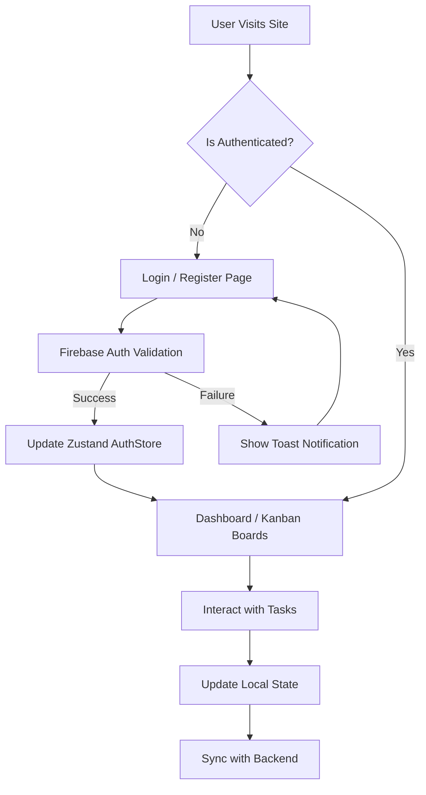

  

  <h1>🚀 TaskMatrix</h1>
  
<strong>The all-in-one agile workspace for modern teams.</strong>

  

    
    
    
    
    
  

---

## 🎯 Problem Statement

Modern engineering and product teams often struggle with fragmented workflows. Task tracking, sprint planning, and team collaboration frequently happen across multiple disparate tools. This fragmentation leads to:
- 📉 Decreased productivity due to context switching.
- 🌫️ Lack of visibility into project status and bottlenecks.
- ⏱️ Inefficient sprint planning and tracking.
- 🎨 Poor user experience with legacy enterprise software.

## 💡 Solution

**TaskMatrix** is a unified, agile project management platform designed to solve these issues. It brings Kanban boards, sprint management, and real-time collaboration into a single, cohesive, and lightning-fast interface. 

With a premium glassmorphic UI, dynamic interactions, and robust state management, TaskMatrix ensures that managing work feels intuitive, seamless, and visually stunning.

---

## 🛠️ Tech Stack & Architecture

TaskMatrix is built on a modern, highly scalable architecture using the latest web technologies.

### 🏗️ Architecture Overview

The application follows a standard modular frontend architecture within the Next.js App Router paradigm:

- **`src/app/`**: Next.js App Router for server/client page routing and layouts (e.g., Auth pages, Dashboard).
- **`src/components/`**: Reusable UI components (Forms, Buttons, Layout wrappers).
- **`src/lib/`**: Core utilities, API clients, and third-party integrations (e.g., Firebase initialization).
- **`src/stores/`**: Global state management using Zustand (e.g., Authentication state, Theme state).
- **`src/types/`**: TypeScript type definitions and Zod schemas for robust validation.

### 💻 Technologies Used

| Category | Technology | Description |
| :--- | :--- | :--- |
| **Framework** | Next.js 16.x | React framework for robust SSR and Client-side rendering. |
| **UI/Styling** | Tailwind CSS v4 | Utility-first CSS framework for rapid, custom design. |
| **State Management**| Zustand | Small, fast, scalable barebones state management. |
| **Authentication**| Firebase Auth | Secure, reliable user authentication (Email/Password). |
| **Animations** | Framer Motion | Production-ready declarative animations. |
| **Forms & Validation**| react-hook-form + Zod | Performant, flexible, and extensible forms with strict schema validation. |
| **Icons** | Lucide React | Beautiful, consistent open-source icons. |

---

## 🔄 Application Flow

---

## 📬 Contact & Let's Connect!

Feel free to reach out if you have any questions, want to collaborate, or just want to say hi!

- 🌐 **Portfolio**: [alpha-portfolio-five.vercel.app](https://alpha-portfolio-five.vercel.app/)
- 💼 **LinkedIn**: [Ayush Ranjan](https://www.linkedin.com/in/ayush-ranjan-9135d3/)
- 🐙 **GitHub**: [ayush-ranjan9135](https://github.com/ayush-ranjan9135)
- 📸 **Instagram**: [@ayush.__.srivastava](https://www.instagram.com/ayush.__.srivastava?igsh=dW1zdHFjcTZnenV2)
- 📘 **Facebook**: [Ayush Ranjan](https://www.facebook.com/share/1AhB4q1WeW/)

 

  Built with ❤️ by Ayush Ranjan.

